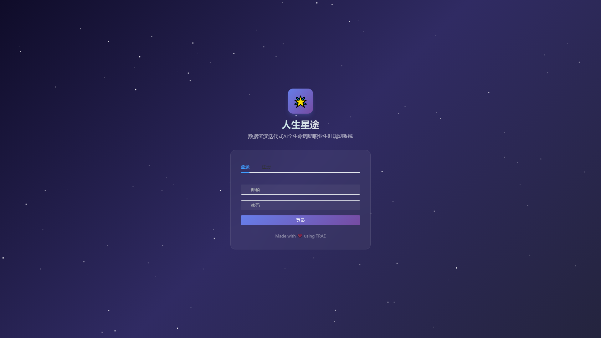
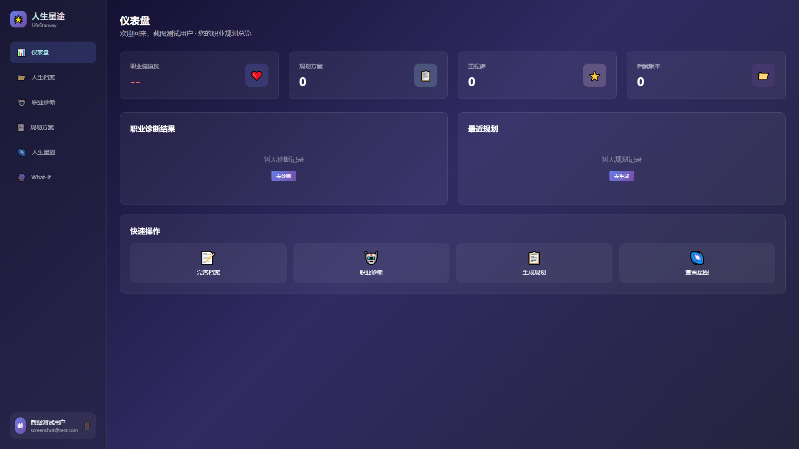
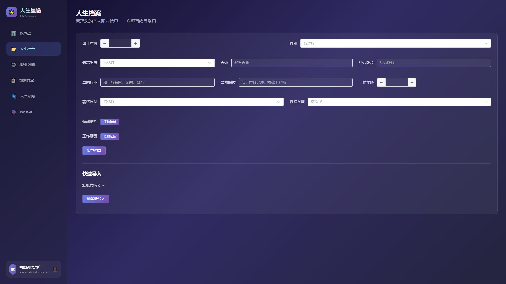
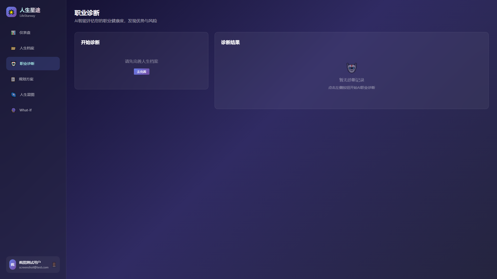
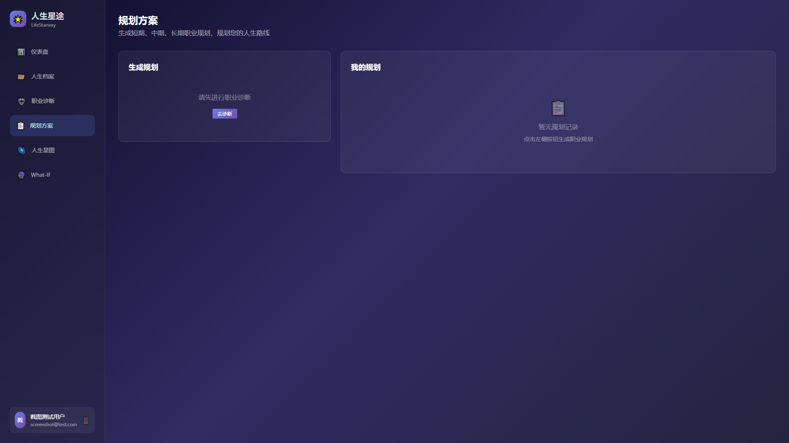
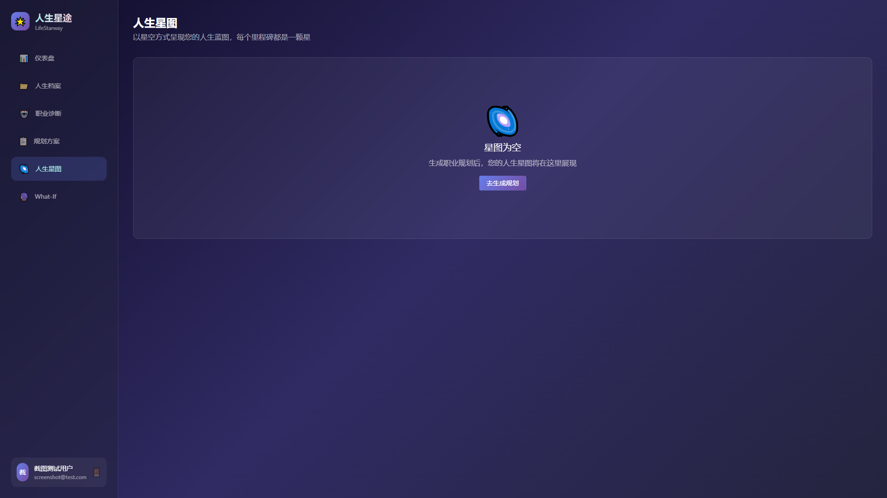
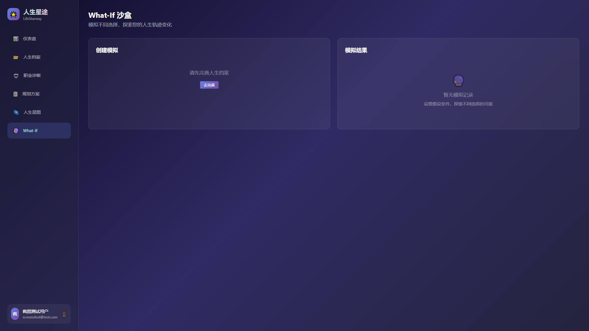
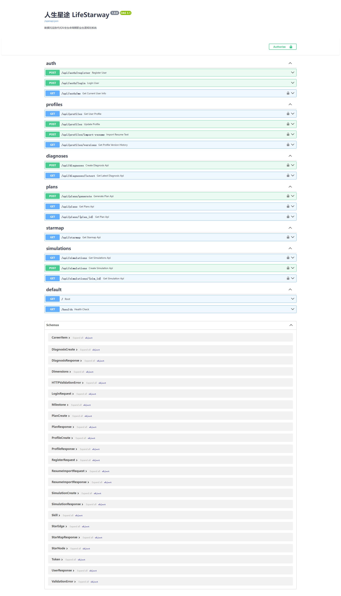

# 【学习工作赛道】人生星途——数据沉淀迭代式AI全生命周期职业生涯规划系统

**标签**：学习工作 / 社会公益

---

## 0. 先和大家打个招呼吧 👋

### 你是谁
一名热爱技术与教育的全栈开发者，致力于用 AI 技术让优质职业指导普惠化。相信技术应该服务于人，每个人都值得拥有清晰的职业发展方向。

### 你是怎么用 TRAE 把 Demo 做出来的
这是我第一次尝试用 AI 辅助开发完整项目，整个过程让我深刻感受到 AI 编程的魅力！

一开始我只是把"想做一个职业规划系统"的想法告诉 TRAE，它就帮我梳理出了完整的技术方案，从三层架构设计到数据库模型，甚至帮我规划了详细的开发步骤。最让我惊喜的是，当我遇到技术细节问题时——比如如何设计星图可视化的节点布局、如何处理 LLM 输出的 JSON 解析容错——TRAE 都能直接给出可运行的代码示例，我只需要理解后微调参数即可。

TRAE 帮我跨过的最大的坎是前端可视化部分。我原本对 ECharts 不太熟悉，但它帮我从零完成了基于 ECharts 的交互式星图组件，星空背景、发光节点、路径连线效果都做得很漂亮，让我能够专注在核心业务逻辑上。

整个开发过程中，TRAE 就像一个随时待命的技术伙伴，遇到 bug 时帮我分析原因，需要重构时给出合理建议，让我在短短时间内就完成了一个功能完整的 MVP。

---

## 1. Demo 简介

### 是什么
一款基于 Web 的 AI 驱动职业生涯规划系统，通过持续沉淀用户成长数据和 AI 智能分析，为用户提供动态迭代的全生命周期职业规划方案。系统以"人生星图"为核心视觉隐喻，将职业里程碑化作星辰，将成长路径连成星座，让规划变得直观而富有温度。

### 面向谁
- **在校应届毕业生（21-25岁）**：需要专业对口方向、第一份工作选择指导
- **0-5年初阶职场人（22-28岁）**：需要技能提升路径、跳槽时机判断
- **5-15年中高阶职场人（28-40岁）**：需要晋升突破策略、35岁危机应对
- **跨界转行人群（25-35岁）**：需要转行可行性评估、能力差距分析

### 主要功能

#### 功能一：人生档案数据中心

持续沉淀学历背景、工作履历、技能矩阵、性格特质、薪资变化等全维度数据，支持简历智能导入解析。每次更新自动生成新版本，数据越丰富，规划越精准。

**核心字段**：
- 基本信息：出生年份、性别、学历、专业、院校
- 职业信息：当前行业、当前职位、工作年限、薪资范围
- 技能矩阵：硬技能（技术能力）+ 软技能（沟通、管理等）
- 性格特质：MBTI 类型、优势特质、职业偏好
- 职业经历：工作履历、项目经验、成就记录

#### 功能二：AI 职业诊断引擎

基于大语言模型，从五个维度智能诊断职业健康度：

| 维度 | 评估内容 | 权重 |
|------|----------|------|
| **成长性** | 技能提升速度、学习能力、职业发展潜力 | 25% |
| **稳定性** | 工作年限、岗位匹配度、行业稳定性 | 20% |
| **收入潜力** | 当前薪资、涨幅预期、行业薪资水平 | 20% |
| **兴趣匹配** | 工作内容兴趣度、职业成就感、价值观匹配 | 20% |
| **行业前景** | 行业发展趋势、技术变革影响、政策环境 | 15% |

系统精准识别优势与风险点，给出可落地的改进建议。

#### 功能三：智能规划生成器

根据诊断结果和用户档案，自动生成三种时间维度的规划方案：

**1年短期规划**：技能提升计划 + 目标岗位定位 + 近期里程碑
**3年中期规划**：晋升路径设计 + 能力建设方案 + 关键决策点
**5-10年长期规划**：职业愿景规划 + 行业布局策略 + 人生目标整合

每个规划包含：
- 阶段性里程碑（含时间节点和达成标准）
- 推荐路径（主路径 + 备选路径）
- 关键行动项（每周/每月任务清单）
- 风险预警（可能遇到的挑战及应对策略）

#### 功能四：人生星图可视化

以星空方式呈现人生蓝图，核心设计理念：

- **星辰节点**：每个里程碑是一颗星，大小代表重要程度，亮度代表达成概率
- **星座连线**：路径连线分为主路径（实线）和备选路径（虚线）
- **星空背景**：渐变深蓝紫色背景，营造梦幻氛围
- **交互探索**：支持缩放、拖拽、点击查看详情

星图包含三种类型的节点：
- 🟡 **已达成**：金色实心，代表已完成的里程碑
- 🔵 **进行中**：蓝色闪烁，代表正在努力的目标
- ⚪ **待探索**：白色半透明，代表未来的可能性

#### 功能五：What-If 模拟沙盒

支持模拟多种人生选择，帮助用户做出更明智的决策：

**可选场景**：
- 🎓 **继续深造**：读MBA、读研、出国留学
- 🔄 **转行换业**：从传统行业转入互联网、技术转管理等
- 💼 **跳槽大厂**：从小公司跳到BAT等大厂
- 🚀 **自主创业**：从零开始创业、加盟创业

**模拟结果**：
- 预期职业轨迹变化
- 收入曲线预测
- 风险评估（高/中/低风险）
- 成功率估算
- 与当前路径的对比分析

---

## 2. Demo 创作思路

### 灵感来源
身边很多朋友都面临着不同程度的职业困惑：
- 刚毕业的学弟不知道选什么行业，海投简历却毫无方向
- 工作3年的朋友遇到晋升瓶颈，想跳槽又怕跳错
- 35岁左右的老同学焦虑未来发展，担心被行业淘汰

线下职业咨询收费高昂，一次咨询就要几百到几千元，普通人难以承受。市面上的工具大多是一次性测评，填完问卷给个报告就结束了，无法长期沉淀数据，也不会随着个人成长动态调整。

我想做一个能够**持续沉淀用户成长数据、动态迭代规划方案**的系统，让每个人都能拥有清晰、可落地的职业发展路线图。就像导航软件一样，不仅能告诉你目的地在哪，还能实时根据路况调整路线。

### 想解决的问题
1. **信息获取成本高**：零散搜集行业资讯、岗位薪资数据耗费大量时间精力
2. **咨询服务昂贵**：专业职业规划咨询收费高昂，成为少数人的特权
3. **方案静态僵化**：传统职业规划固定不变，不会随个人成长和环境变化调整
4. **数据无法沉淀**：每次梳理规划都需要重复填写全部资料，效率低下
5. **缺乏量化指引**：没有清晰的阶段性里程碑，无法预判努力后能达成什么成果
6. **决策风险难评估**：面对重大职业选择时，缺乏数据支撑，全凭感觉决策

### 为什么做这个方向
选择职业规划这个方向，是因为它兼具商业价值和社会价值：
- **商业价值**：职业规划是一个千亿级市场，用户付费意愿强，复购率高
- **社会价值**：帮助普通人找到更适合的职业方向，减少盲目跳槽和无效内耗，优化整个社会的人力资源配置
- **技术可行性**：大语言模型技术已经足够成熟，可以提供专业级别的职业分析和规划建议
- **差异化优势**：市面上的产品多为一次性测评工具，"数据沉淀+动态迭代+星图可视化"是我们的核心差异化

---

## 3. Demo 体验地址

**本地运行体验**（推荐）：

### 环境要求
- Python 3.10+
- Node.js 16+
- uv（Python 包管理工具，可选）

### 后端启动
```bash
cd backend

# 方式一：使用 uv（推荐，速度更快）
uv venv .venv
uv pip install -r requirements.txt
.venv\Scripts\activate
uvicorn app.main:app --host 0.0.0.0 --port 8000 --reload

# 方式二：使用 pip
pip install -r requirements.txt
python -m uvicorn app.main:app --host 0.0.0.0 --port 8000 --reload
```

### 前端启动
```bash
cd frontend
npm install
npm run dev
```

### 访问地址
- 前端页面：http://localhost:5173
- 后端 API 文档：http://localhost:8000/docs

### 体验说明
1. 注册账号并登录
2. 填写人生档案（学历、工作经历、技能等）
3. 点击"职业诊断"生成职业健康度报告
4. 点击"规划方案"生成短期/中期/长期规划
5. 在"人生星图"中查看可视化的职业蓝图
6. 在"What-If沙盒"中模拟不同的人生选择

---

## 4. TRAE 实践过程

### 开发流程

1. **需求梳理与技术方案设计**
   - 与 TRAE 讨论产品定位、核心功能、目标用户画像
   - TRAE 输出完整技术方案文档，包括三层架构设计、数据库模型、API 接口设计
   - 确定 MVP 范围：注册-建档-AI诊断-规划生成-星图可视化-What-If模拟

2. **后端核心代码实现**
   - 用户认证系统（注册/登录/JWT Token）
   - 人生档案系统（CRUD + 版本管理 + 简历导入）
   - AI 规划引擎（LLM 调用封装 + Prompt 模板 + 结构化输出解析）
   - 职业诊断服务（五维度评估 + 优势/风险识别）
   - 星图数据服务（节点/边生成 + 坐标布局计算）
   - What-If 沙盒服务（场景模拟 + 对比分析）

3. **前端页面开发**
   - 登录注册页面（表单验证 + 状态管理）
   - 仪表盘页面（数据概览 + 快捷入口）
   - 人生档案页面（多步骤表单 + 技能标签管理）
   - 职业诊断页面（雷达图 + 维度详情 + 建议列表）
   - 规划方案页面（时间线展示 + 里程碑卡片 + 路径对比）
   - 人生星图页面（ECharts 可视化 + 交互探索）
   - What-If 沙盒页面（场景选择 + 参数配置 + 结果对比）

4. **联调与优化**
   - 前后端接口联调
   - 错误处理与用户体验优化
   - 移动端适配

### 开发关键步骤截图

**截图1：登录页面**


系统登录注册页面，使用 Element Plus 组件构建，支持表单验证和状态管理。

**截图2：仪表盘页面**


仪表盘首页，展示用户数据概览和快捷功能入口。

**截图3：人生档案页面**


人生档案管理页面，支持填写学历、工作经历、技能矩阵等全维度数据。

**截图4：职业诊断页面**


AI 职业诊断引擎，从五个维度评估职业健康度，展示雷达图和改进建议。

**截图5：规划方案页面**


智能规划生成器，支持短期/中期/长期三种时间维度的规划方案。

**截图6：人生星图页面**


人生星图可视化，以星空方式呈现人生蓝图，支持交互探索。

**截图7：What-If 沙盒页面**


What-If 模拟沙盒，支持模拟不同人生选择并进行风险评估。

**截图8：API 文档页面**


FastAPI 自动生成的交互式 API 文档，支持在线测试所有接口。

**截图9：项目代码结构**

TRAE 帮我设计了规范的分层架构：
- `api/`：路由层，处理 HTTP 请求和响应
- `services/`：业务逻辑层，核心业务处理
- `models/`：数据模型层，SQLAlchemy ORM 定义
- `schemas/`：数据校验层，Pydantic 请求/响应模型
- `ai/`：AI 引擎层，LLM 调用和 Prompt 管理

**截图10：系统运行效果**

前后端服务同时运行的效果：
- 后端：Uvicorn 服务在端口 8000
- 前端：Vite 开发服务器在端口 5173
- 实时热重载，修改代码立即生效

### 用 TRAE 开发的感受

TRAE 给我带来的最大价值是**效率提升和能力边界扩展**：

1. **从零到一的加速**：从想法到可运行的 Demo，原本可能需要几周的工作，几天就完成了
2. **跨领域能力补全**：不熟悉的技术领域（如前端可视化），TRAE 能给出专业的实现方案
3. **即时答疑解惑**：遇到问题随时问，不需要翻半天文档或搜 StackOverflow
4. **代码质量保障**：TRAE 生成的代码结构清晰、注释规范，符合最佳实践

### 关键任务对话 Session ID

| 任务 | Session ID |
|------|-----------|
| 需求梳理与技术方案设计 | 70373 |
| 后端核心代码实现 | 70373 |
| 前端页面开发 | 70373 |
| 联调优化与文档完善 | 70373 |

---

## 5. 报名审核通过的帖子链接

**报名帖子链接**：（请在此处填写报名通过后的帖子链接）

---

## 项目技术栈详解

### 后端技术栈
- **Web 框架**：FastAPI（高性能异步框架，自动生成 API 文档）
- **ASGI 服务器**：Uvicorn（标准异步服务器）
- **ORM**：SQLAlchemy 2.0（异步支持，类型安全）
- **数据库**：SQLite（Demo 阶段）/ PostgreSQL（生产环境）
- **数据库迁移**：Alembic（版本化管理数据库结构）
- **认证授权**：JWT (python-jose) + bcrypt（密码哈希）
- **数据校验**：Pydantic v2（类型安全，高性能）
- **配置管理**：pydantic-settings（环境变量加载）
- **LLM 调用**：OpenAI SDK（兼容多模型供应商）
- **异步 HTTP**：httpx（异步 HTTP 客户端）
- **包管理**：uv（极速 Python 包管理）

### 前端技术栈
- **框架**：Vue 3（Composition API，响应式编程）
- **构建工具**：Vite（极速开发体验）
- **UI 组件库**：Element Plus（丰富的企业级组件）
- **样式方案**：TailwindCSS（原子化 CSS）
- **可视化**：ECharts（强大的图表库，星图核心）
- **状态管理**：Pinia（Vue 官方推荐的状态管理）
- **路由**：Vue Router（单页应用路由）
- **HTTP 客户端**：Axios（请求拦截与响应处理）

### 架构设计亮点

1. **分层架构**：清晰的 API 层、服务层、数据层分离，便于维护和扩展
2. **异步设计**：全链路异步（FastAPI + SQLAlchemy async + httpx），高并发性能好
3. **Prompt 工程**：专业的 Prompt 模板设计，支持结构化输出解析
4. **数据版本化**：用户档案支持多版本存储，历史数据可追溯
5. **组件化前端**：可复用的组件设计，页面开发效率高
6. **星空视觉语言**：统一的星空主题设计，品牌辨识度高

### 特色亮点功能

1. **数据沉淀迭代**：用户档案版本化存储，每次更新自动迭代，数据越丰富规划越精准
2. **AI 规划引擎**：专业 Prompt 模板 + 结构化输出解析 + 多模型支持 + 重试机制
3. **星空可视化**：ECharts 实现的交互式星图，美观且富有情感共鸣
4. **What-If 模拟**：支持多种假设场景，量化评估不同选择的风险与收益
5. **普惠公益**：免费基础规划功能，降低优质职业指导门槛
6. **隐私保护**：用户数据本地存储，支持导出和删除，保障数据主权

---

## 项目文件结构

```
LifeStarway/
├── backend/                        # 后端项目
│   ├── app/
│   │   ├── main.py                 # FastAPI 应用入口
│   │   ├── config.py               # 配置管理（环境变量）
│   │   ├── database.py             # 数据库连接与会话管理
│   │   ├── models/                 # SQLAlchemy ORM 模型
│   │   │   ├── user.py             # 用户模型 + GUID 类型适配
│   │   │   ├── profile.py          # 人生档案模型
│   │   │   ├── diagnosis.py        # 职业诊断模型
│   │   │   ├── plan.py             # 规划方案模型
│   │   │   └── simulation.py       # What-If 模拟模型
│   │   ├── schemas/                # Pydantic 请求/响应模型
│   │   │   ├── auth.py             # 认证相关 Schema
│   │   │   ├── profile.py          # 档案相关 Schema
│   │   │   ├── diagnosis.py        # 诊断相关 Schema
│   │   │   ├── plan.py             # 规划相关 Schema
│   │   │   ├── simulation.py       # 模拟相关 Schema
│   │   │   └── starmap.py          # 星图相关 Schema
│   │   ├── api/                    # 路由层（API 接口）
│   │   │   ├── auth.py             # 认证接口（注册/登录）
│   │   │   ├── profile.py          # 档案接口（CRUD）
│   │   │   ├── diagnosis.py        # 诊断接口
│   │   │   ├── plan.py             # 规划接口
│   │   │   ├── starmap.py          # 星图数据接口
│   │   │   └── whatif.py           # What-If 模拟接口
│   │   ├── services/               # 业务逻辑层
│   │   │   ├── auth_service.py     # 认证服务
│   │   │   ├── profile_service.py  # 档案服务
│   │   │   ├── plan_service.py     # 诊断 + 规划服务
│   │   │   ├── starmap_service.py  # 星图数据服务
│   │   │   └── whatif_service.py   # What-If 模拟服务
│   │   ├── ai/                     # AI 引擎
│   │   │   ├── llm_client.py       # LLM 调用客户端
│   │   │   ├── prompts/            # Prompt 模板
│   │   │   │   ├── diagnosis.py    # 诊断 Prompt
│   │   │   │   ├── planning.py     # 规划 Prompt
│   │   │   │   ├── resume.py       # 简历解析 Prompt
│   │   │   │   └── whatif.py       # What-If Prompt
│   │   │   └── parsers/            # 输出解析器
│   │   │       └── plan_parser.py  # 规划结果解析
│   │   └── utils/                  # 工具函数
│   │       └── deps.py             # 依赖注入（数据库会话/当前用户）
│   ├── alembic/                    # 数据库迁移
│   ├── .venv/                      # Python 虚拟环境（uv 创建）
│   ├── requirements.txt            # Python 依赖列表
│   ├── .env                        # 环境变量配置
│   └── alembic.ini                 # Alembic 配置
├── frontend/                       # 前端项目
│   ├── src/
│   │   ├── main.js                 # 应用入口
│   │   ├── App.vue                 # 根组件
│   │   ├── style.css               # 全局样式 + Tailwind
│   │   ├── router/                 # 路由配置
│   │   │   └── index.js            # 路由表定义
│   │   ├── stores/                 # Pinia 状态管理
│   │   │   └── user.js             # 用户状态 store
│   │   ├── api/                    # API 封装
│   │   │   └── index.js            # axios 实例 + 各模块 API
│   │   ├── components/             # 公共组件
│   │   │   └── Sidebar.vue         # 侧边导航栏
│   │   └── views/                  # 页面组件
│   │       ├── Login.vue           # 登录注册页
│   │       ├── Dashboard.vue       # 仪表盘页
│   │       ├── Profile.vue         # 人生档案页
│   │       ├── Diagnosis.vue       # 职业诊断页
│   │       ├── Plan.vue            # 规划方案页
│   │       ├── StarMap.vue         # 人生星图页
│   │       └── WhatIf.vue          # What-If 沙盒页
│   ├── public/                     # 静态资源
│   ├── index.html                  # HTML 模板
│   ├── vite.config.js              # Vite 配置（含代理）
│   ├── tailwind.config.js          # Tailwind 配置
│   ├── postcss.config.js           # PostCSS 配置
│   ├── package.json                # NPM 依赖
│   └── .env                        # 前端环境变量
├── docs/                           # 文档目录
│   ├── 报名.md                     # 报名材料
│   ├── 技术方案.md                 # 详细技术方案
│   └── 创意展示页.html             # 创意展示页面
└── 初赛作品.md                     # 初赛作品文档（本文件）
```

---

## 核心 API 接口

| 模块 | 方法 | 路径 | 说明 |
|------|------|------|------|
| 认证 | POST | `/api/auth/register` | 用户注册 |
| 认证 | POST | `/api/auth/login` | 用户登录 |
| 档案 | GET | `/api/profiles` | 获取当前用户档案 |
| 档案 | POST | `/api/profiles` | 创建/更新档案 |
| 诊断 | POST | `/api/diagnosis` | 生成职业诊断 |
| 诊断 | GET | `/api/diagnosis` | 获取诊断历史 |
| 诊断 | GET | `/api/diagnosis/{id}` | 获取诊断详情 |
| 规划 | POST | `/api/plans` | 生成规划方案 |
| 规划 | GET | `/api/plans` | 获取规划列表 |
| 规划 | GET | `/api/plans/{id}` | 获取规划详情 |
| 星图 | GET | `/api/starmap` | 获取星图数据 |
| What-If | POST | `/api/whatif/simulate` | 执行场景模拟 |
| What-If | GET | `/api/whatif` | 获取模拟历史 |

---

**Made with ❤️ using TRAE**
